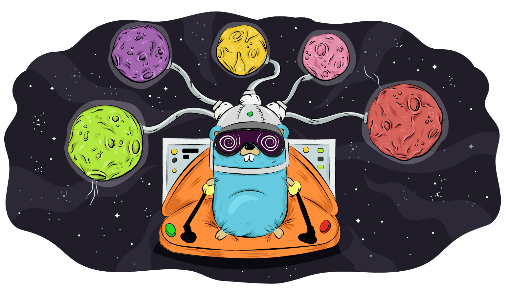

# kafka-event-sourcing-tutorial

<!--  -->

### Intro
This repo is the result of some code from following along with this link: https://semaphoreci.com/community/tutorials/writing-and-testing-an-event-sourcing-microservice-with-kafka-and-go. 

To get it all running you need the following downloaded and running locally: 
- Apache Zookeeper: `https://zookeeper.apache.org/`
- Apache Kafka: `https://www.apache.org/dyn/closer.cgi?path=/kafka/0.10.2.0/kafka_2.11-0.10.2.0.tgz`
- Go: `https://golang.org/doc/install?download=go1.8.1.darwin-amd64.pkg`
	- NB: Go wants your `myproject` go code to be stored at `$HOME/go/src/myproject`
- Redis: `https://redis.io/download`

### Final Putting It all Together
- Need a redis server running
	- `redis-server`
- Need Kafka and Zookeeper running
	- `cd ~/personal/TechnicalLearning/kafka-event-sourcing-tutorial/kafka_2.11-0.10.1.0`
	- `bin/zookeeper-server-start.sh config/zookeeper.properties`
	- `bin/kafka-server-start.sh config/server.properties`
- Run banku
	- `cd ~/go/src/banku`
	- `./banku --act=consumer`
	- `./banku`

